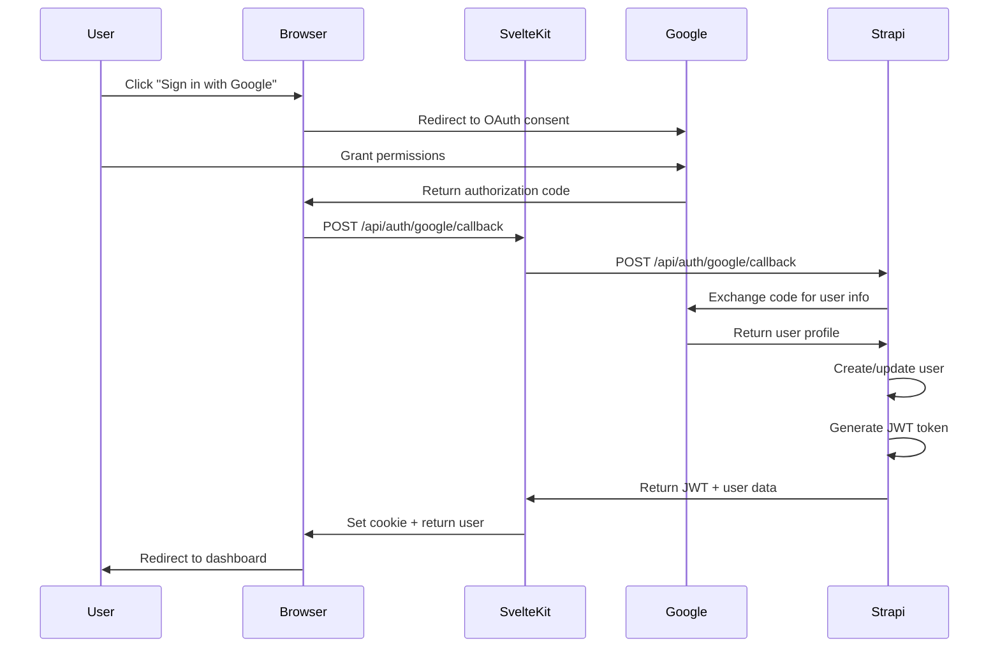

# Design Document - Google OAuth Authentication with Strapi

## Overview

This design implements Google OAuth 2.0 authentication integrated with Strapi's Users & Permissions plugin. The system replaces the existing Supabase authentication with a Strapi-based solution that provides:

- Google OAuth 2.0 sign-in flow
- JWT-based session management
- User data storage in Strapi
- Seamless integration with existing SvelteKit application
- Secure token handling and validation

The implementation leverages Strapi's built-in Users & Permissions plugin with the Google OAuth provider, eliminating the need for Supabase while maintaining all authentication functionality.

## Architecture

### High-Level Flow

```
User → SvelteKit App → Google OAuth → Callback Handler → Strapi API → JWT Token → Client Store
```

### Components

1. **Frontend (SvelteKit)**
   - Login page with Google Sign-In button
   - Auth store managing user state
   - Protected routes with authentication guards
   - API routes for OAuth callback handling

2. **Backend (Strapi)**
   - Users & Permissions plugin with Google provider
   - JWT token generation and validation
   - User CRUD operations
   - OAuth callback endpoint

3. **External Services**
   - Google OAuth 2.0 (accounts.google.com)
   - Google Identity Services (GSI) library

### Authentication Flow



## Components and Interfaces

### 1. Strapi Configuration

#### Google OAuth Provider Setup

**File**: `strapi-backend/config/plugins.ts`

```typescript
export default ({ env }) => ({
  'users-permissions': {
    config: {
      grant: {
        google: {
          enabled: true,
          icon: 'google',
          key: env('GOOGLE_CLIENT_ID'),
          secret: env('GOOGLE_CLIENT_SECRET'),
          callback: env('GOOGLE_OAUTH_CALLBACK_URL', '/api/auth/google/callback'),
          scope: ['email', 'profile'],
        },
      },
      jwt: {
        expiresIn: '30d',
      },
    },
  },
});
```

**Environment Variables** (`.env`):
```
GOOGLE_CLIENT_ID=your-client-id.apps.googleusercontent.com
GOOGLE_CLIENT_SECRET=your-client-secret
GOOGLE_OAUTH_CALLBACK_URL=http://localhost:5173/api/auth/google/callback
```

### 2. SvelteKit Auth Store

**File**: `new-app/src/lib/stores/auth.js`

```javascript
import { writable, derived } from 'svelte/store';
import { browser } from '$app/environment';

// Configuration
const STRAPI_URL = import.meta.env.VITE_STRAPI_URL || 'http://localhost:1337';
const GOOGLE_CLIENT_ID = import.meta.env.VITE_GOOGLE_CLIENT_ID;

// Stores
export const currentUser = writable(null);
export const authToken = writable(null);
export const isAuthenticated = derived(currentUser, $user => !!$user);
export const isLoading = writable(false);

// Initialize from localStorage
if (browser) {
  const storedToken = localStorage.getItem('authToken');
  const storedUser = localStorage.getItem('currentUser');
  
  if (storedToken && storedUser) {
    authToken.set(storedToken);
    currentUser.set(JSON.parse(storedUser));
    validateToken(storedToken);
  }
}

// Validate JWT token
async function validateToken(token) {
  try {
    const response = await fetch(`${STRAPI_URL}/api/users/me`, {
      headers: {
        'Authorization': `Bearer ${token}`
      }
    });
    
    if (!response.ok) {
      throw new Error('Invalid token');
    }
    
    const user = await response.json();
    currentUser.set(user);
  } catch (error) {
    console.error('Token validation failed:', error);
    signOut();
  }
}

// Sign in with Google (using Google Identity Services)
export async function signInWithGoogle(credential) {
  isLoading.set(true);
  
  try {
    // Send credential to our callback handler
    const response = await fetch('/api/auth/google/callback', {
      method: 'POST',
      headers: { 'Content-Type': 'application/json' },
      body: JSON.stringify({ credential })
    });
    
    if (!response.ok) {
      throw new Error('Authentication failed');
    }
    
    const data = await response.json();
    
    // Store token and user
    authToken.set(data.jwt);
    currentUser.set(data.user);
    
    if (browser) {
      localStorage.setItem('authToken', data.jwt);
      localStorage.setItem('currentUser', JSON.stringify(data.user));
    }
    
    return { success: true };
  } catch (error) {
    return { success: false, error: error.message };
  } finally {
    isLoading.set(false);
  }
}

// Sign out
export async function signOut() {
  authToken.set(null);
  currentUser.set(null);
  
  if (browser) {
    localStorage.removeItem('authToken');
    localStorage.removeItem('currentUser');
  }
  
  return { success: true };
}

export { GOOGLE_CLIENT_ID };
```

### 3. OAuth Callback Handler

**File**: `new-app/src/routes/api/auth/google/callback/+server.js`

```javascript
import { json } from '@sveltejs/kit';
import { STRAPI_URL, STRAPI_API_TOKEN } from '$env/static/private';

export async function POST({ request }) {
  try {
    const { credential } = await request.json();
    
    if (!credential) {
      return json({ error: 'Missing credential' }, { status: 400 });
    }
    
    // Verify and exchange Google credential with Strapi
    const response = await fetch(`${STRAPI_URL}/api/auth/google/callback`, {
      method: 'POST',
      headers: {
        'Content-Type': 'application/json',
      },
      body: JSON.stringify({
        id_token: credential
      })
    });
    
    if (!response.ok) {
      const error = await response.text();
      console.error('Strapi auth error:', error);
      return json({ error: 'Authentication failed' }, { status: response.status });
    }
    
    const data = await response.json();
    
    // Return JWT and user data
    return json({
      jwt: data.jwt,
      user: data.user
    });
    
  } catch (error) {
    console.error('OAuth callback error:', error);
    return json({ error: 'Internal server error' }, { status: 500 });
  }
}
```

### 4. Login Page Updates

**File**: `new-app/src/routes/login/+page.svelte`

Key changes:
- Remove Supabase client initialization
- Update `signInWithGoogle` to use new auth store
- Keep Google Identity Services (GSI) button rendering
- Update error handling for Strapi responses

### 5. Protected Routes Middleware

**File**: `new-app/src/hooks.server.js`

```javascript
export async function handle({ event, resolve }) {
  // Get auth token from cookie or header
  const authToken = event.cookies.get('authToken') || 
                   event.request.headers.get('authorization')?.replace('Bearer ', '');
  
  if (authToken) {
    try {
      // Validate token with Strapi
      const response = await fetch(`${STRAPI_URL}/api/users/me`, {
        headers: {
          'Authorization': `Bearer ${authToken}`
        }
      });
      
      if (response.ok) {
        const user = await response.json();
        event.locals.user = user;
        event.locals.authToken = authToken;
      }
    } catch (error) {
      console.error('Auth validation error:', error);
    }
  }
  
  return resolve(event);
}
```

## Data Models

### Strapi User Model

Strapi's built-in User model (from Users & Permissions plugin) includes:

```typescript
interface StrapiUser {
  id: number;
  username: string;
  email: string;
  provider: string; // 'google' for OAuth users
  confirmed: boolean;
  blocked: boolean;
  createdAt: string;
  updatedAt: string;
  // Custom fields we'll add:
  name?: string;
  avatar?: string;
  googleId?: string;
}
```

### Client-Side User State

```typescript
interface ClientUser {
  id: number;
  email: string;
  name: string;
  avatar: string;
  provider: string;
}
```

### JWT Token Structure

```typescript
interface JWTPayload {
  id: number; // User ID
  iat: number; // Issued at
  exp: number; // Expiration
}
```

## Correctness Properties

*A property is a characteristic or behavior that should hold true across all valid executions of a system-essentially, a formal statement about what the system should do. Properties serve as the bridge between human-readable specifications and machine-verifiable correctness guarantees.*


### Property 1: Authorization code exchange
*For any* valid authorization code received from Google, the system should successfully exchange it for user profile information
**Validates: Requirements 1.3**

### Property 2: User record creation or update
*For any* user profile information received from Google, the system should either create a new user record or update an existing one in Strapi
**Validates: Requirements 1.4**

### Property 3: JWT generation after user operation
*For any* user record creation or update, the system should generate a valid JWT token
**Validates: Requirements 1.5**

### Property 4: Token storage on authentication
*For any* successful authentication, the JWT token should be stored securely in browser storage
**Validates: Requirements 2.1**

### Property 5: Token validation on page refresh
*For any* page refresh with a stored token, the system should validate that token with Strapi
**Validates: Requirements 2.2**

### Property 6: Auth state restoration for valid tokens
*For any* valid JWT token, the system should restore the user's authenticated state
**Validates: Requirements 2.3**

### Property 7: Auth state clearing for invalid tokens
*For any* invalid or expired JWT token, the system should clear the authentication state and redirect to login
**Validates: Requirements 2.4**

### Property 8: Token clearing on logout
*For any* logout action, the system should clear the stored JWT token from browser storage
**Validates: Requirements 3.1**

### Property 9: Auth state reset after token clear
*For any* token clear operation, the authentication state should be reset to null
**Validates: Requirements 3.2**

### Property 10: Redirect after auth reset
*For any* authentication state reset, the system should redirect the user to the login page
**Validates: Requirements 3.3**

### Property 11: New user record creation
*For any* new user authenticating via Google, the system should create a user record in Strapi with their Google profile data
**Validates: Requirements 4.1**

### Property 12: Existing user record update
*For any* existing user re-authenticating via Google, the system should update their user record with current Google profile data
**Validates: Requirements 4.2**

### Property 13: User data completeness
*For any* user data storage operation, the stored record should include email, name, profile picture, and Google ID
**Validates: Requirements 4.3**

### Property 14: Provider field marking
*For any* user record created via Google OAuth, the provider field should be set to "google"
**Validates: Requirements 4.4**

### Property 15: OAuth failure error handling
*For any* Google OAuth failure, the system should display a user-friendly error message
**Validates: Requirements 5.1**

### Property 16: Network error handling
*For any* network error during authentication, the system should either retry the request or display an error message
**Validates: Requirements 5.4**

### Property 17: HTTPS usage for OAuth
*For any* OAuth flow initiation, all authentication requests should use HTTPS protocol
**Validates: Requirements 6.1**

### Property 18: Secure token storage
*For any* token storage operation, the system should use secure methods (httpOnly cookies or secure browser storage)
**Validates: Requirements 6.2**

### Property 19: JWT signature verification
*For any* JWT validation operation, the system should verify the token signature using Strapi's secret key
**Validates: Requirements 6.3**

### Property 20: Re-authentication on token expiry
*For any* expired token, the system should require re-authentication
**Validates: Requirements 6.4**

### Property 21: User info display after authentication
*For any* successful authentication, the system should display the user's name and profile picture
**Validates: Requirements 7.1**

### Property 22: User-specific content personalization
*For any* user viewing the dashboard, the system should show content personalized to their Strapi user ID
**Validates: Requirements 7.2**

### Property 23: Protected route authentication verification
*For any* protected route access attempt, the system should verify authentication before rendering content
**Validates: Requirements 7.3**

## Error Handling

### OAuth Errors

1. **Google OAuth Failure**
   - Scenario: Google returns an error during OAuth flow
   - Handling: Display user-friendly error message, log technical details
   - User Action: Retry authentication or contact support

2. **Permission Denial**
   - Scenario: User denies Google permissions
   - Handling: Redirect to login with message explaining permissions are required
   - User Action: Retry with permissions granted

3. **Invalid Credential**
   - Scenario: Google credential is invalid or tampered
   - Handling: Display error message, prevent authentication
   - User Action: Retry authentication

### Backend Errors

1. **Strapi Unavailable**
   - Scenario: Strapi backend is down or unreachable
   - Handling: Display connection error, retry with exponential backoff
   - User Action: Wait and retry, or contact support

2. **User Creation Failure**
   - Scenario: Strapi fails to create/update user record
   - Handling: Log error, display generic error message
   - User Action: Retry authentication

3. **JWT Generation Failure**
   - Scenario: Strapi fails to generate JWT token
   - Handling: Log error, display authentication error
   - User Action: Retry authentication

### Token Errors

1. **Expired Token**
   - Scenario: JWT token has expired
   - Handling: Clear auth state, redirect to login
   - User Action: Re-authenticate

2. **Invalid Token**
   - Scenario: JWT token is malformed or invalid
   - Handling: Clear auth state, redirect to login
   - User Action: Re-authenticate

3. **Token Validation Failure**
   - Scenario: Strapi rejects token during validation
   - Handling: Clear auth state, redirect to login
   - User Action: Re-authenticate

### Network Errors

1. **Connection Timeout**
   - Scenario: Request to Strapi or Google times out
   - Handling: Retry with exponential backoff (max 3 attempts)
   - User Action: Check connection, retry

2. **Network Unavailable**
   - Scenario: No internet connection
   - Handling: Display offline message
   - User Action: Check connection, retry when online

## Testing Strategy

### Unit Testing

Unit tests will verify individual functions and components:

1. **Auth Store Tests**
   - Test `signInWithGoogle()` with mocked responses
   - Test `signOut()` clears state correctly
   - Test `validateToken()` with valid/invalid tokens
   - Test localStorage operations

2. **Callback Handler Tests**
   - Test credential validation
   - Test Strapi API calls with mocked responses
   - Test error handling for various failure scenarios
   - Test JWT and user data extraction

3. **Component Tests**
   - Test login page renders Google button
   - Test error message display
   - Test loading states
   - Test redirect after successful auth

### Property-Based Testing

Property-based tests will verify universal properties across many inputs using **fast-check** library for JavaScript:

1. **Token Operations**
   - Generate random JWT tokens and verify validation logic
   - Generate random user data and verify storage completeness
   - Test token expiry handling with various expiration times

2. **User Data Handling**
   - Generate random Google profile data and verify user creation/update
   - Verify provider field is always set to "google"
   - Verify required fields (email, name, avatar, googleId) are always present

3. **Error Handling**
   - Generate random error scenarios and verify appropriate error messages
   - Verify auth state is always cleared on errors
   - Verify redirects happen correctly

4. **Security Properties**
   - Verify all OAuth requests use HTTPS
   - Verify tokens are stored securely
   - Verify JWT signatures are always validated

### Integration Testing

Integration tests will verify end-to-end flows:

1. **Complete OAuth Flow**
   - Test full authentication flow from button click to dashboard
   - Verify user creation in Strapi
   - Verify JWT token generation and storage
   - Verify session persistence across page refreshes

2. **Protected Routes**
   - Test access to protected routes with valid token
   - Test redirect to login without token
   - Test redirect to login with expired token

3. **Logout Flow**
   - Test complete logout process
   - Verify token removal
   - Verify redirect to login
   - Verify cannot access protected routes after logout

### Manual Testing Checklist

1. ✅ Click "Sign in with Google" button
2. ✅ Complete Google OAuth consent
3. ✅ Verify redirect to dashboard
4. ✅ Verify user info displayed correctly
5. ✅ Refresh page and verify session persists
6. ✅ Logout and verify redirect to login
7. ✅ Verify cannot access dashboard after logout
8. ✅ Test with new Google account (user creation)
9. ✅ Test with existing Google account (user update)
10. ✅ Test error scenarios (deny permissions, network errors)

## Security Considerations

### Token Security

1. **JWT Storage**
   - Store in httpOnly cookies when possible (server-side rendering)
   - Use secure flag for cookies (HTTPS only)
   - Alternative: localStorage with XSS protection

2. **Token Expiration**
   - Set reasonable expiration (30 days default)
   - Implement token refresh mechanism if needed
   - Clear expired tokens automatically

3. **Token Validation**
   - Always validate JWT signature
   - Verify token hasn't been tampered with
   - Check expiration on every request

### OAuth Security

1. **HTTPS Only**
   - All OAuth requests must use HTTPS
   - Redirect URIs must be HTTPS in production
   - Prevent downgrade attacks

2. **State Parameter**
   - Use state parameter to prevent CSRF
   - Validate state on callback
   - Generate cryptographically secure random state

3. **Credential Validation**
   - Verify Google credential signature
   - Check credential hasn't expired
   - Validate issuer and audience claims

### Data Protection

1. **User Data**
   - Store minimal required data
   - Don't store sensitive Google data
   - Comply with GDPR/privacy regulations

2. **API Keys**
   - Store Google Client ID/Secret in environment variables
   - Never expose secrets in client-side code
   - Rotate keys periodically

3. **CORS Configuration**
   - Restrict CORS to known origins
   - Don't use wildcard (*) in production
   - Validate origin on every request

## Implementation Notes

### Strapi Setup Steps

1. Install Users & Permissions plugin (included by default)
2. Configure Google OAuth provider in Strapi admin panel
3. Add custom fields to User model (name, avatar, googleId)
4. Configure JWT settings (expiration, secret)
5. Set up CORS for SvelteKit origin

### SvelteKit Setup Steps

1. Remove Supabase dependencies
2. Update auth store to use Strapi API
3. Create OAuth callback route
4. Update login page to use new auth flow
5. Update protected routes to use JWT validation
6. Add environment variables for Google OAuth

### Migration from Supabase

1. Export existing users from Supabase
2. Import users into Strapi
3. Map Supabase user IDs to Strapi user IDs
4. Update all user references in application
5. Test authentication with existing users
6. Decommission Supabase after verification

### Environment Variables Required

**Strapi** (`.env`):
```
GOOGLE_CLIENT_ID=your-client-id
GOOGLE_CLIENT_SECRET=your-client-secret
GOOGLE_OAUTH_CALLBACK_URL=http://localhost:5173/api/auth/google/callback
```

**SvelteKit** (`.env`):
```
VITE_STRAPI_URL=http://localhost:1337
VITE_GOOGLE_CLIENT_ID=your-client-id
STRAPI_URL=http://localhost:1337
STRAPI_API_TOKEN=your-api-token
```

## Dependencies

### New Dependencies

**SvelteKit**:
- None (uses native fetch and browser APIs)

**Strapi**:
- `@strapi/plugin-users-permissions` (included by default)
- `grant` (OAuth library, included with users-permissions)

### Removed Dependencies

**SvelteKit**:
- `@supabase/supabase-js` (remove)
- Supabase CDN script (remove from HTML)

## Performance Considerations

1. **Token Validation Caching**
   - Cache validated tokens for short period (5 minutes)
   - Reduce Strapi API calls
   - Invalidate cache on logout

2. **Lazy Loading**
   - Load Google Identity Services script only on login page
   - Defer non-critical auth checks

3. **Optimistic UI Updates**
   - Update UI immediately on auth actions
   - Validate in background
   - Rollback on validation failure

## Deployment Considerations

1. **Environment Configuration**
   - Use production Google OAuth credentials
   - Set production callback URLs
   - Enable HTTPS for all endpoints

2. **Strapi Configuration**
   - Set production JWT secret
   - Configure production CORS origins
   - Enable rate limiting for auth endpoints

3. **Monitoring**
   - Log authentication attempts
   - Monitor failed auth attempts
   - Alert on unusual patterns

4. **Backup Strategy**
   - Regular backups of Strapi database
   - Export user data periodically
   - Test restore procedures
